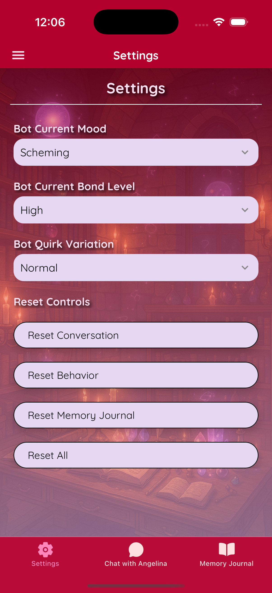

# Enchanta


**Enchanta** is a cross-platform mobile app where you journey across breathtaking landscapes with your magical companion, **Angelina** — a clever, crimson-eyed red mage. Whether you're chatting with her or venturing into procedurally generated adventures, Enchanta blends narrative-driven gameplay with dynamic AI interactions.

---

## ✨ Features

### 🧙 Personal Chatbot


- **Talk to Angelina**, your personal AI mage companion with a vibrant, evolving personality.
- Conversations adapt to the context, time of day, and emotional cues.
- View Angelina’s **memory journal**—her private thoughts and reflections on your conversations.
- **Customize** her mood, quirks, and appearance—or let her personality shift naturally through dialogue.

---

### 🗺️ Adventure Mode


- **Procedurally generated adventures**—each run is unique.
- Travel through mysterious landscapes:
  - Sky Islands
  - Spirit Forest
  - Frostveil Ruins
  - Obsidian Caverns
  - Crimson Marshlands
- Each location offers distinct environments, challenges, and story arcs.
- Make decisions that lead to **victory, defeat, or surprising twists**.
- Save your favorite endings and revisit them any time.
- Angelina is with you throughout, offering guidance, commentary, and companionship.

---

## 📱 Screenshots

### 💬 Chatbot Mode

<div class="image-container">
  
  
  
  
  
  
</div>

---

### 🧭 Adventure Mode

<div class="image-container">
  
  
  
  
  
  
  
  
  
  
  
  
</div>

---

## ⚙️ Tech Stack

- **React Native** – Cross-platform mobile app framework.
- **Expo** – Toolkit for building and deploying mobile apps with ease.
- **TypeScript** – Statically typed JavaScript for better code quality.
- **SQLite** – Local database storage for offline access and state retention.

---

## 🚀 Getting Started

### Prerequisites

- Node.js
- Expo CLI (`npm install -g expo-cli`)
- Android Studio or Xcode for emulators/simulators (or a physical device with the Expo app)

### Installation

1. Clone the repository:

   ```bash
   git clone https://github.com/DragunWF/Enchanta.git
   cd Enchanta
   ```

2. Install dependencies:

   ```bash
   npm install
   ```

3. Configure environment variables:
   
   Create an `.env` file in the root directory of the project and add the following variables:

   ```
   EXPO_PUBLIC_GEMINI_API_KEY=your_gemini_api_key
   ```

5. Run the app:

   - For Android:

   ```bash
   npm run android
   ```

   - For iOS:

   ```bash
   npm run ios
   ```

   Alternatively, scan the QR code shown in your terminal using the [Expo Go app](https://expo.dev/go) from the Google Play Store or Apple App Store.
